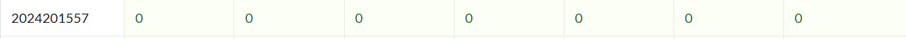
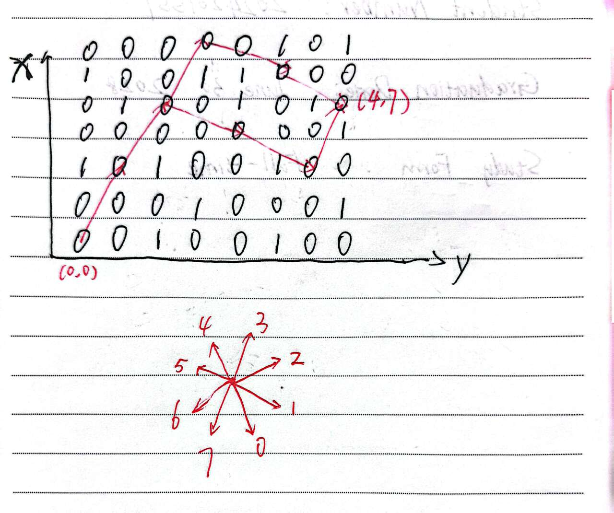

# bomblab 报告

姓名：蔡松洋

学号：2024201557

| 总分 | phase_1 | phase_2 | phase_3 | phase_4 | phase_5 | phase_6 | secret_phase |
| --------- | ------------- | ------------- | ------------- | ----------------- |-----------|-----------|-----------|
| 7        | 1            | 1            | 1            | 1 |1  |1  |1  |


scoreboard 截图：


### phase_1

答案：
```
Zuorhi viyantas was festsu ruor proi, yuk dalfe suoivo swenne yat vu henvi nes.
```

讲解题目思路：
- phase_1 在反汇编中调用了 `strings_not_equal` 与一个只读数据段里的字符串比较（内存中的地址为 `0x3180` ）。
- 在打断点的时候容易发现，如果要查询 x 地址内的东西，我输入的指令就应该是x/s (0x555555554000 + x)
- 我用 (gdb) x/s 0x555555557180 命令定位到了该常量字符串，反馈结果：
```
0x555555557180: "Zuorhi viyantas was festsu ruor proi, yuk dalfe suoivo swenne yat vu henvi nes." 
```
因此只要输入完全一致的那一行文本即可拆除 phase_1。

### phase_2

答案：
```
331245 192437 400116 478856
```

讲解题目思路：

- 反汇编代码核心代码段含义：
```
1484: callq 1150 <__isoc99_sscanf@plt>  # 读取输入
1489: cmp $0x4,%eax           # 检查是否读取了4个数字
14bb: lea 0x4c5e(%rip),%rsi   # 加载matB矩阵地址
148e: lea 0x4cab(%rip),%rdi   # 加载matA矩阵地址
14d8: imul (%rsi,%rax,8),%edx # 矩阵乘法运算
151c: cmp %eax,(%rsp,%rbx,1)  # 比较计算结果
```

- 拆除炸弹逻辑：
phase_2需要输入4个整数，进行3×3矩阵乘法运算
通过GDB获取内存中的matA和matB矩阵数据
模拟汇编代码中的矩阵乘法逻辑：对两个3×3矩阵进行乘法和累加
计算结果必须与输入的4个数字完全匹配
通过打印内存中存储的矩阵计算后的结果，输出答案

- 获取内存数据的指令：
```
# 查看输入格式：
(gdb) x/s $rsi
反馈结果：0x5555555575f1: "%d %d %d %d"，说明需要输入四个整数 
# 查看矩阵数据
(gdb) x/24wx 0x555555556140  # matA矩阵
(gdb) x/24wx 0x555555556120  # matB矩阵
# 查看计算结果    
Breakpoint 3, 0x0000555555555502 in phase_2 ()		# 在比较前设置断点
(gdb) x/4wx $rsp+0x10								# 查看栈中计算结果
0x7fffffffcea0: 0x00050ded      0x0002efb5      0x00061af4      0x00074e88
# 将以上四个十六进制数转化成十进制就是答案！
```

### phase_3

答案（不唯一）：
```
0 S 831
```

讲解题目思路：
- 反汇编代码核心代码段的含义
```
156e: callq 1150 <__isoc99_sscanf@plt>  # 读取输入
1573: cmp $0x2,%eax           # 检查输入数量
1578: mov 0x4b92(%rip),%eax   # 加载mask值
157e: xor %al,0xf(%rsp)       # 对字符进行异或操作
1582: cmpl $0x7,0x10(%rsp)    # 检查第一个数字范围
1598: movslq (%rdx,%rax,4),%rax # 跳转表查找
```

- 获取内存数据的指令：
```
# 查看格式字符串
Breakpoint 2, 0x000055555555556e in phase_3 ()
(gdb) x/s $rsi
0x555555557205: "%d %c %d"		# 说明输入是一个数字 一个字母 一个数字
# 查看掩码值
0x000055555555557e in phase_3 ()
(gdb) p /x $eax
$1 = 0x20
# 输入字符 char_input 会与 0x20 异或，得到一个新字符，这个新字符必须与 case 中预期的字符匹配。
```

- 拆除炸弹逻辑：
phase_3需要输入"数字 字符 数字"格式
第一个数字作为跳转表索引，必须在0-7范围内
字符会与mask进行异或操作
第二个数字必须与特定分支的期望值匹配
通过分析跳转表和每个分支的条件，找到有效的数字字符组合
汇编代码中，case 0 的代码位于 0x15a8:
```
15a8: b8 73 00 00 00        mov    $0x73,%eax   ; 将 0x73 ('s') 放入 eax
15ad: 81 7c 24 14 3f 03 00  cmpl   $0x33f,0x14(%rsp) ; 比较 value 与 0x33f (831)
15b4: 00 
15b5: 0f 84 e1 00 00 00     je     169c         ; 如果相等，跳转到检查字符
```
0x73 xor 0x20 = 0x50，ASCII码对应字母"S"
所以最后答案可以是 "0 S 831"

### phase_4

答案：
```
31 AC
```

- 反汇编代码核心代码段含义：
```
17a8: callq 1150 <__isoc99_sscanf@plt>  # 读取输入
17ad: cmp $0x2,%eax           # 检查2个输入
17b7: callq 16c3 <func4_1>    # 递归函数计算
17bc: cmp %eax,0xc(%rsp)      # 比较计算结果
17f3: callq 16e9 <func4_2>    # 字符串生成函数
1800: callq 1d5b <strings_not_equal> # 字符串比较
```

- 获取内存数据的指令：
```
# 查看输入格式
0x00005555555557a8 in phase_4 ()
(gdb) x/s $rsi
0x55555555720e: "%d %2s"		# 输入一个整数和一个长度为2的字符串
```

- 讲解题目思路：
phase_4需要输入两个值：数字和字符串

第一个数字通过递归函数func4_1计算，结果必须等于func4_1(5)
步骤1: 计算 func4_1(5) 的值
func4_1 是一个递归函数，逻辑如下：
如果 n <= 0，返回 0。
如果 n == 1，返回 1。
否则，返回 2 * func4_1(n-1) + 1。
func4_1(1) = 1
func4_1(2) = 2 * 1 + 1 = 3
func4_1(3) = 2 * 3 + 1 = 7
func4_1(4) = 2 * 7 + 1 = 15
func4_1(5) = 2 * 15 + 1 = 31
因此，输入的第一个整数必须是 31

步骤2: 确定 func4_2 生成的字符串
func4_2 也是一个递归函数，用于生成字符串。调用参数为：
edi = 5
esi = 0x13 (十进制 19)
edx = 0x41 (ASCII 'A')
ecx = 0x43 (ASCII 'C')
r8d = 0x42 (ASCII 'B')
r9 = buffer (地址 0x14(%rsp))
func4_2(5, 19, 'A', 'C', 'B', buf) 调用 func4_2(4, 3, 'B', 'C', 'A', buf)
func4_2(4, 3, 'B', 'C', 'A', buf) 调用 func4_2(3, 3, 'B', 'A', 'C', buf)
func4_2(3, 3, 'B', 'A', 'C', buf) 调用 func4_2(2, 3, 'B', 'C', 'A', buf)
func4_2(2, 3, 'B', 'C', 'A', buf) 调用 func4_2(1, 1, 'A', 'C', 'B', buf)
func4_2(1, 1, 'A', 'C', 'B', buf) 直接写入缓冲区：buf[0] = 'A', buf[1] = 'C', buf[2] = '\0'

因此，phase_4 的完整输入是："31 AC"

### phase_5

答案（不唯一）：
```
-6 38
```

反汇编代码核心代码段含义：
```
1840: sub    $0x18,%rsp                 ; 分配栈空间
1854: lea    0x4(%rsp),%rcx             ; 第二个输入存储地址
1859: mov    %rsp,%rdx                  ; 第一个输入存储地址
185c: lea    0x1d94(%rip),%rsi          ; 格式字符串地址（%d %d）
1863: callq  1150 <__isoc99_sscanf@plt> ; 读取输入
1868: cmp    $0x1,%eax                  ; 检查输入数量是否大于1
186d: cmpl   $0x0,(%rsp)                ; 检查第一个输入是否非负
1878: mov    (%rsp),%eax                ; 取第一个输入
187b: and    $0xf,%eax                  ; 取低4位
187e: mov    %eax,(%rsp)                ; 存储低4位
1881: cmp    $0xf,%eax                  ; 检查低4位是否等于15
1886: mov    $0x0,%ecx                  ; 初始化累加和
188b: mov    $0x0,%edx                  ; 初始化计数器
1890: lea    0x19c9(%rip),%rsi          ; 加载数组地址（0x3260）
1897: add    $0x1,%edx                  ; 计数器增加
189a: cltq                              ; 扩展eax到rax
189c: mov    (%rsi,%rax,4),%eax         ; 从数组加载值
189f: add    %eax,%ecx                  ; 累加值
18a1: cmp    $0xf,%eax                  ; 检查值是否等于15
18a4: jne    1897                       ; 不等于15则继续循环
18a6: movl   $0xf,(%rsp)                ; 存储15到栈
18ad: cmp    $0x5,%edx                  ; 检查计数器是否等于5
18b2: cmp    %ecx,0x4(%rsp)             ; 比较累加和与第二个输入
18b8: callq  1fc0 <explode_bomb>        ; 如果条件不满足则爆炸
```

- 获取内存数据的指令：
```
# 查看输入格式
Breakpoint 2, 0x0000555555555863 in phase_5 ()
(gdb) x/s $rsi
0x5555555575f7: "%d %d"		# 输入两个整数
# 查看数组内容
Breakpoint 3, 0x0000555555555890 in phase_5 ()
(gdb) x/16wd 0x555555557260
0x555555557260 <array.0>:       10      2       14      7
0x555555557270 <array.0+16>:    8       12      15      11
0x555555557280 <array.0+32>:    0       4       1       13
0x555555557290 <array.0+48>:    3       9       6       5
```

- 讲解题目思路：
phase_5需要输入一个整数，取其低4位作为数组索引
程序会遍历数组，直到遇到值15(0xf)为止
遍历次数必须恰好为5次
遍历过程中所有数组值的累加和必须等于第二个期望值
通过分析数组内容和条件，找到满足遍历次数和累加和要求的输入
输入格式：两个整数（假设为 a 和 b）。
条件1：第一个整数 a 必须非负，且 a 的低 4 位不能等于 15（即 a & 0xf != 15）。
数组访问：有一个16元素的整数数组在地址 0x3260。以 a 的低4位作为起始索引，访问数组：
从起始索引开始，每次用当前值作为下一个索引，访问数组值。
重复这个过程，直到遇到值15。
条件2：访问必须恰好进行5次（即计数器 edx 等于5），意味着第5次访问的值必须是15。
条件3：访问过程中所有数组值的累加和必须等于第二个整数 b。

我们不难得倒起始索引 s = 10（即第一个输入值的低4位为10）
遍历序列：
array[10] = 1（第一次加载）
array[1] = 2（第二次加载）
array[2] = 14（第三次加载）
array[14] = 6（第四次加载）
array[6] = 15（第五次加载）

累加和 = 1 + 2 + 14 + 6 + 15 = 38，第二个数应为 38
第一个输入值必须是负数，且低 4 位为 10。例如：-6 或者 -22、-38 等

### phase_6

答案：
```
1 5 4 6 3 2
```

反汇编代码及核心代码段含义：
```
1902: callq 2080 <read_six_numbers>  # 读取6个数字
194e: mov %ecx,%eax
1950: sub (%r12),%eax         # 7 - 输入数字
1954: mov %eax,(%r12)         # 存储转换后的值
196f: lea 0x48aa(%rip),%rdx   # 加载链表头节点
197b: mov 0x8(%rdx),%rdx      # 遍历链表节点
19a3: mov %rax,0x8(%rbx)      # 重建链表连接
1a0b: mov 0x8(%rbx),%rax
1a11: cmp %eax,(%rbx)         # 检查节点值降序
```

- 讲解题目思路：
phase_6需要输入6个1-6的唯一整数
程序将每个输入转换为：7 - 输入数字
转换后的数字作为链表节点索引（1=node1, 2=node2, ...）
根据输入顺序重新连接链表节点
重建后的链表节点值必须按降序排列
通过分析节点值，找到使链表降序的输入序列

- 获取内存数据的指令：
```
# 查看链表节点
Breakpoint 1, 0x00005555555558d7 in phase_6 ()
(gdb) x/24wx 0x55555555a220
0x55555555a220 <node1>: 0x00000211      0x00000001      0x5555a230      0x00005555
0x55555555a230 <node2>: 0x000003a2      0x00000002      0x5555a240      0x00005555
0x55555555a240 <node3>: 0x000002b5      0x00000003      0x5555a250      0x00005555
0x55555555a250 <node4>: 0x000001ef      0x00000004      0x5555a260      0x00005555
0x55555555a260 <node5>: 0x0000010e      0x00000005      0x5555a170      0x00005555
0x55555555a270: 0x00000000      0x00000000      0x00000000      0x00000000
# 我们预期在第一列读到六个非零的数字，结果，第六个数字被藏到其他地方去了
# 好在，第三列标注了链表的下一个地址，我们继续查询：
(gdb) x/4wx 0x55555555a170
0x55555555a170 <node6>: 0x000003be      0x00000006      0x00000000      0x00000000
# 这样我们就得到了六个数字，降序序列是：6 2 3 1 4 5，那么我们输入的应该是 1 5 4 6 3 2
```

## secret_phase

答案 / 触发与拆除方法：
```
(第六行行末空格后) unlock
33113
```

查找secret_phase的方法：
- 在本仓库的 README 中明确给出了secret word: unlock，在第六行后空格输入 unlock 即可进入 secret_phase，简直不费吹灰之力。

拆除方法：
这是一个关于马跳日（骑士巡游）的隐藏关卡。
- 主要反汇编代码含义：
- func7函数分析：
```
1a40: sub $0x98,%rsp          # 分配大栈空间（用于存储棋盘和方向数组）
1a5f-1b5d:                    # 初始化多个数组到栈上
# 这些数组存储了马跳日的8个方向偏移量

1b5e: cmp $0x4,%esi           # 检查行坐标是否为4
1b61: jne 1bce                # 不是则跳转
1b63: cmp $0x7,%edx           # 检查列坐标是否为7  
1b66: jne 1bce                # 不是则跳转
# 这里(4,7)很可能是终点位置

1b6b: movzbl (%rdi,%rcx,1),%esi  # 读取输入字符串的字符
1b84: and $0x7,%r10d          # 取字符的低3位作为方向索引
1b8b: and $0x7,%esi           # 同样取低3位
```
- secret_phase函数分析：
```
1c67: push %rbx
1c84: cmp $0x14,%eax          # 检查输入长度是否<=20
1c89: mov $0x0,%ecx           # 初始化参数
1c8e: mov $0x0,%edx           # 起点列坐标 = 0
1c93: mov $0x0,%esi           # 起点行坐标 = 0  
1b5e: cmp $0x4,%esi   		  # 终点行坐标 = 4
1b63: cmp $0x7,%edx   		  # 终点列坐标 = 7
1c98: mov %rbx,%rdi           # 输入字符串
1c9b: callq 1a40 <func7>      # 调用马跳日函数
1ca0: test %eax,%eax          # 检查返回值
1ca2: je 1cbe                 # 为0则成功，否则爆炸
```

- 获取内存数据的指令：
```
# 获取地图样貌 
Breakpoint 1, 0x0000555555555c67 in secret_phase ()
(gdb) x/20gx 0x55555555a1b0
0x55555555a1b0 <row0>:  0x0000010000010000      0x000055555555a1c0
0x55555555a1c0 <row1>:  0x0100000001000000      0x000055555555a1d0
0x55555555a1d0 <row2>:  0x0000010000010001      0x000055555555a1e0
0x55555555a1e0 <row3>:  0x0000000000000001      0x000055555555a1f0
0x55555555a1f0 <row4>:  0x0001000100000100      0x000055555555a200
0x55555555a200 <row5>:  0x0000000101000001      0x000055555555a210
0x55555555a210 <row6>:  0x0100010000000000      0x000055555555a160
# 1 表示地图上那个位置有障碍，0 表示空地可以走
# 注意：由于计算机采取小端序存储，所以实际画图的时候应注意调换顺序

# 获取跳马规则
(gdb) x/32wd $rsp
0x7fffffffce20: -2      -1      1       2
0x7fffffffce30: 2       1       -1      -2
0x7fffffffce40: 1       2       2       1
0x7fffffffce50: -1      -2      -2      -1
0x7fffffffce60: -1      0       0       1
0x7fffffffce70: 1       0       0       -1
0x7fffffffce80: 0       1       1       0
0x7fffffffce90: 0       -1      -1      0
# 前两行表示 0-7 八种跳法的 x 坐标的变化，然后跟着的两行表示 0-7 跳法的 y 坐标的变化
# 跳马时，不仅要检查终点是否为空地，还要检查马脚是否为空地
# 第五第六行表示进行 0-7 八种跳法时分别需要检验的马脚的相对横坐标
# 第七第八行表示进行 0-7 八种跳法时分别需要检验的马脚的相对纵坐标
```

#### 马跳日的八个方向分别是：
(-2,1), (-1,2), (1,2), (2,1), (2,-1), (1,-2), (-1,-2), (-2,-1)
#### 马脚分别是：
(-1,0), (0,1), (0,1), (1,0), (1,0), (0,-1), (0,-1), (-1,0)
与中国象棋规则一致

- 跳马方法的寻找：

如图所示，我们不难找到五步就抵达终点的办法：33113 或 33311
至此，我们顺利地解决了所有炸弹！

### 完整解决bomblab的答案示例：
```
Zuorhi viyantas was festsu ruor proi, yuk dalfe suoivo swenne yat vu henvi nes.
331245 192437 400116 478856
0 S 831
31 AC
-6 38 
1 5 4 6 3 2 unlock
33113
```

## 反馈/收获/感悟/总结
bomblab太难了，我花费了24小时甚至更多的时间解决问题，如果算上写报告的时间，至少是30小时
拆炸弹难度很大，其一是我不熟悉汇编指令，很多时候想要打印某地内存的东西要问AI怎么打印，耗费时间
其二是代码量太大，分析汇编代码的含义非常困难，一行行分析推理跳转逻辑、存储位置非常繁琐
有些时候遇到不会的地方，或者是因为自己分析错了，就会根本无从下手，AI可能都无法给出解答
最后只好询问相同作业的同学，求得解答（非常感谢！）

## 参考的重要资料
1. 特别致谢y同学帮我完成了拆炸弹的任务，帮助我从内存中打印了关键信息
2. 感谢AI帮我完成了很多我不懂的gdb指令
3. 基础的汇编指令，主要是从课堂习得